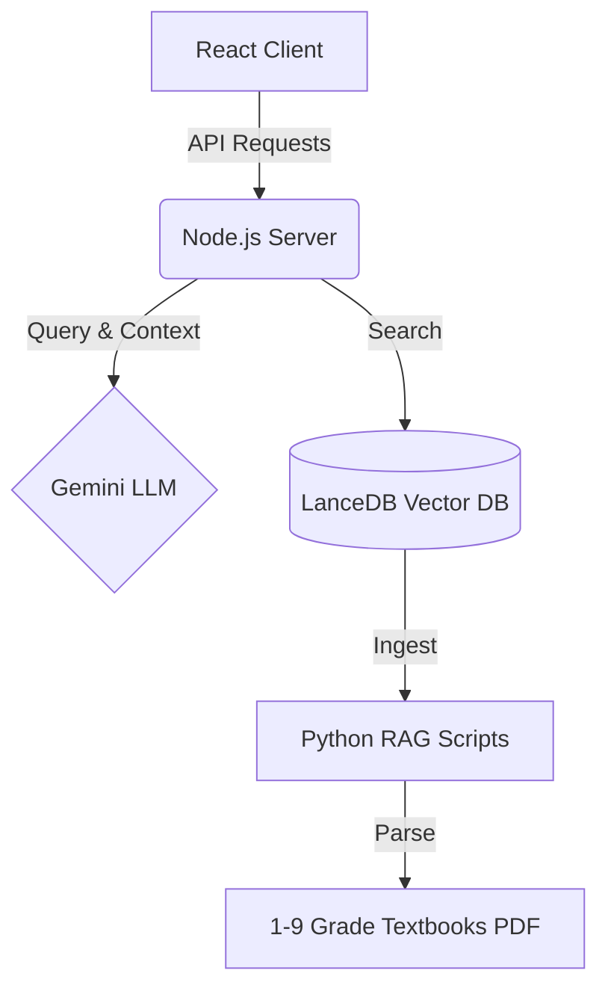

<div align="center">

# 🎓 EduAgent : AI Tutor for K-9 Education

**国内首个专为 1-9 年级量身定制的开源 RAG AI 智能教辅系统**

[](https://reactjs.org/)
[](https://nodejs.org/)
[](https://python.org/)
[](https://lancedb.com/)
[](https://opensource.org/licenses/MIT)

[**中文版**](README.md) | [**English**](README_en.md)

*“教育公平从来不是一句口号。让普通家庭的孩子，也能拥有最顶尖的专属私教。”*

</div>

---

## 📸 界面预览 (UI Showcase)


---

## 中文版

### 🎯 项目概述 (Overview)
**EduAgent** 是一款开源的、基于 RAG（检索增强生成）的 AI 辅导系统，专为 K-9（1-9年级）学生设计。利用大语言模型和 LanceDB 向量数据库，它提供了一种自适应的、本地化的和高度互动的教育体验。

“教育公平从来不是一句口号。我们致力于将顶级的 AI 私人教师带入每一个普通家庭。”

### 🌟 核心特性 (Features)

EduAgent 摒弃了传统的“直接给答案”模式，而是基于大模型（Gemini）与精准向量库（RAG）构建了真正的**引导式智能体**：

- 🧠 **双模态教学引擎**：
  - **1-3年级（童趣模式）**：语言生动活泼，多鼓励、多比喻，保护孩子学习兴趣。
  - **4-9年级（逻辑模式）**：侧重思维导图、逻辑推演与错题闭环。
- 📚 **精准 RAG 知识库**：深度集成人教版教材 PDF，所有 AI 回答强制优先引用课本原话，杜绝大模型“幻觉”。
- 🗣️ **苏格拉底提问法**：遇到难题不给最终答案，而是通过启发式提问（如“你觉得第一步应该先求什么？”）引导孩子自主解题。
- 📷 **多模态搜题**：支持直接拍照上传作业题目，AI 自动进行 OCR 解析并分步指导。
- 📒 **智能错题本**：后台自动追踪孩子反复出错的知识点并收录，支持一键生成“举一反三”变式练习卷。

### 🛠️ 技术架构 (Tech Stack)



### 🚀 快速开始 (Quick Start)

#### 1. 环境准备
- **Node.js** (v18 或更高)
- **Python** (3.8 - 3.11)

#### 2. 安装与构建
```bash
# 克隆仓库并安装后端依赖
git clone https://github.com/Zenglian990/AI_Tutor_Release.git
cd AI_Tutor_Release
npm install

# 安装 Python 依赖 (用于 RAG 知识库更新)
pip install -r requirements.txt

# 构建前端页面
cd client && npm install && npm run build && cd ..
```

#### 3. 环境变量配置
复制配置模板并填写您的密钥：
```bash
cp .env.example .env
```
在 `.env` 中填写：
- `GEMINI_API_KEY`: 您的 Google Gemini API 密钥
- `PROXY_URL`: (可选) 代理地址，如 `http://127.0.0.1:7897`

#### 4. 知识库初始化
> **🎁 开箱即用**：本发行版已内置约 90MB 的人教版教材向量数据，您可以跳过此步直接启动！

如需加载最新教材：
```bash
# 将 PDF 教材放入 data/textbooks/ 后运行：
python scripts/ingest_2_0.py
```

#### 5. 一键启动服务
- **Windows**: 双击运行 `启动AI辅导.bat`
- **Mac/Linux**: `sh start.sh` 或者直接运行 `npm start`
服务启动后，系统将自动打开 `http://localhost:3001`。

## 🤝 参与贡献 (Contributing)
我们非常欢迎社区成员的参与！无论您是开发者、教育工作者还是家长，都欢迎提交 Pull Request 或提出 Issue。让我们共同把这个工具打磨得更好，惠及更多普通家庭。

---
*由曾练与开源社区倾情打造 ❤️ (Built with ❤️ by Zeng Lian & the Open Source Community)*
