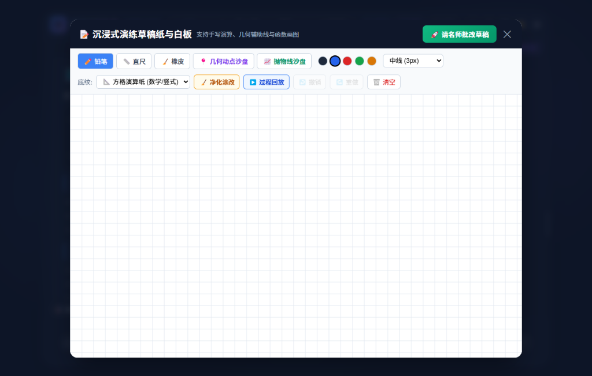
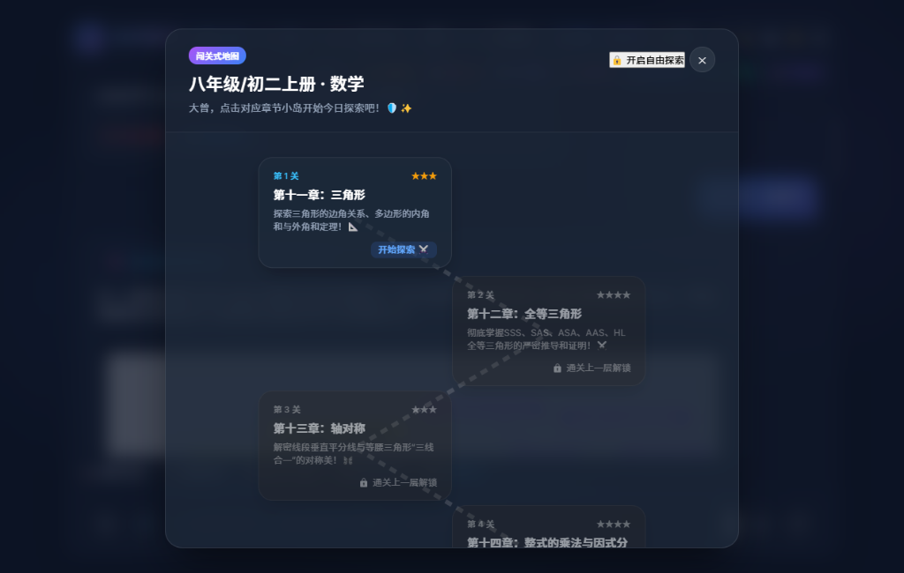
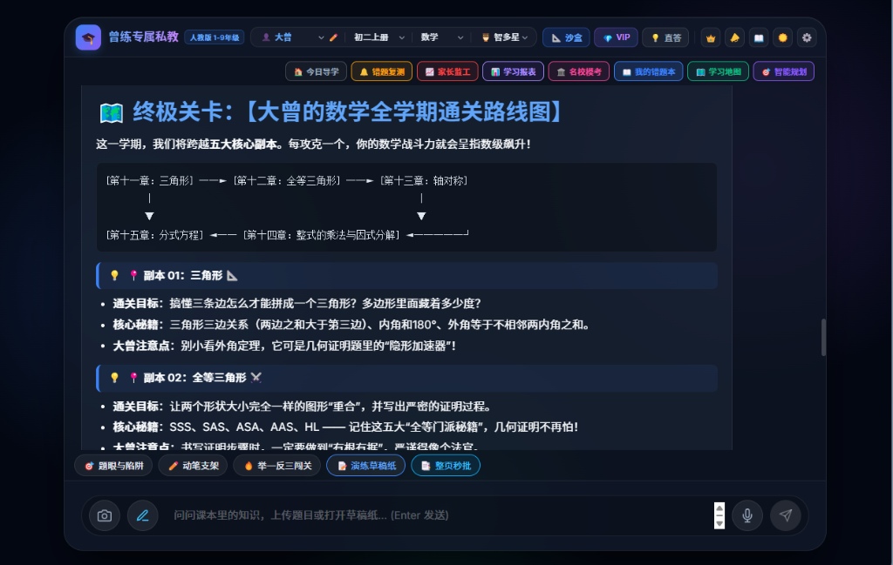
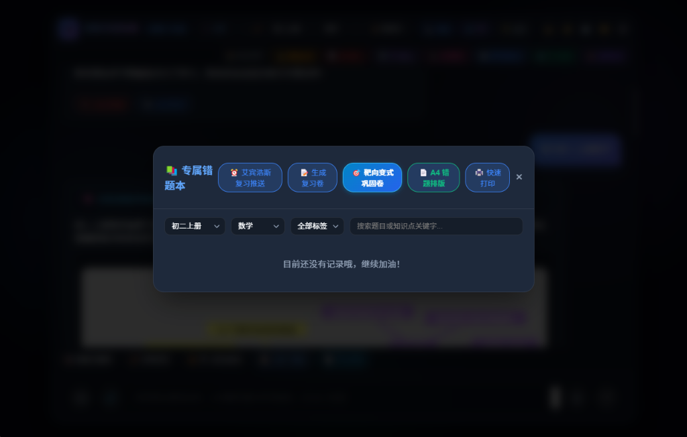
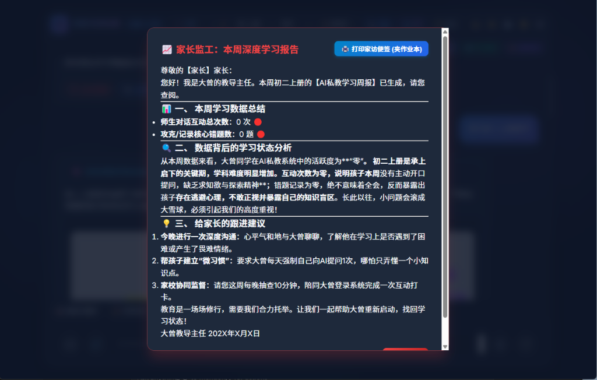
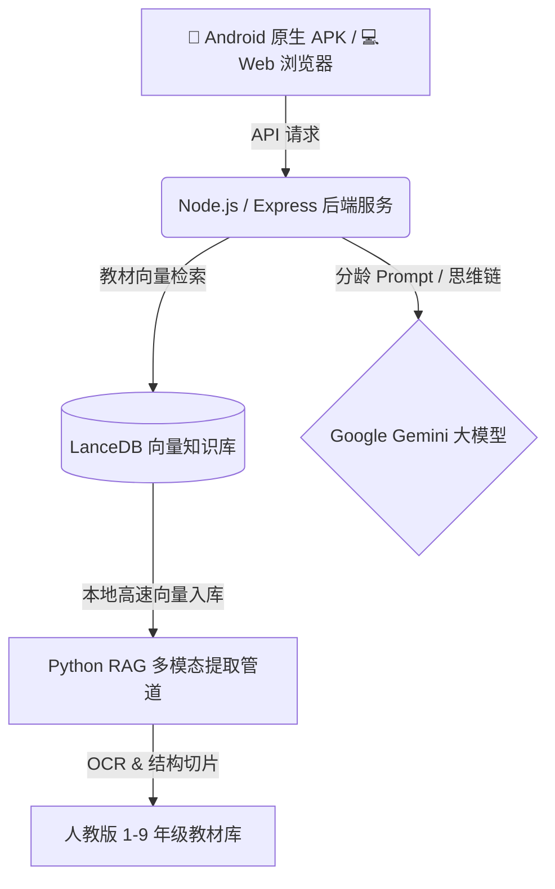

<div align="center">

# 🎓 曾练专属私教 (ZengLian AI Tutor)

**国内首个专为 1-9 年级量身定制的开源 RAG AI 智能私教系统**
*覆盖人教版 1-9 年级全学科知识库 · 双模态自适应心智教学 · 闭环提分体系*

<br/>

[](https://github.com/Zenglian990/AI_Tutor_Release/releases/download/v1.0.0-apk/ZengLian_AI_Tutor_v1.3.0.apk)
[](https://github.com/Zenglian990/AI_Tutor_Release/releases/download/v1.0.0-apk/ZengLian_AI_Tutor_v1.0.0.ipa)
[](https://ai-tutor-release.onrender.com)
[](https://github.com/Zenglian990/AI_Tutor_Release/releases/tag/v1.0.0-apk)

<br/>

[](https://reactjs.org/)
[](https://nodejs.org/)
[](https://capacitorjs.com/)
[](https://lancedb.com/)
[](https://deepmind.google/technologies/gemini/)
[](https://opensource.org/licenses/MIT)

[**中文文档**](README.md) | [**English**](README_en.md) | [**🤖 Android 下载 (v1.3.0)**](https://github.com/Zenglian990/AI_Tutor_Release/releases/download/v1.0.0-apk/ZengLian_AI_Tutor_v1.3.0.apk) | [**🍎 iOS 安装指南**](#-移动双端与桌面全平台支持-android--ios--pc) | [**🌐 云端体验**](https://ai-tutor-release.onrender.com)

> *“教育公平从来不是一句口号。让普通家庭的孩子，也能拥有最顶尖的专属私教。”*

</div>

---

## 📱 移动双端与桌面全平台支持 (Android / iOS / PC)

无需繁琐的本地开发环境配置，手机和电脑均可即装即用体验专为全场景优化的 **全学科智能私教**：

### 🤖 1. 安卓端 (Android 手机 / 平板)
- **📥 最新版安装包直链下载**：[ZengLian_AI_Tutor_v1.3.0.apk (约 8.9MB)](https://github.com/Zenglian990/AI_Tutor_Release/releases/download/v1.0.0-apk/ZengLian_AI_Tutor_v1.3.0.apk)
- **📥 历史版备用直链**：[ZengLian_AI_Tutor_v1.0.0.apk](https://github.com/Zenglian990/AI_Tutor_Release/releases/download/v1.0.0-apk/ZengLian_AI_Tutor_v1.0.0.apk)
- **✨ 特性**：内嵌 0 秒即读本地原声与云端双模态语音、原生 9:16 锁定竖屏全屏、零配置点开即用。

### 🍎 2. 苹果端 (iPhone / iPad)
- **🌟 方案 A（官方推荐·免签名免越狱·1秒添加至桌面）**：
  1. 使用 iPhone / iPad 自带的 **Safari 浏览器** 打开云端地址：[https://ai-tutor-release.onrender.com](https://ai-tutor-release.onrender.com)
  2. 点击 Safari 底部中央的 **【分享按钮 📤】**；
  3. 下滑选择 **【添加到主屏幕】** ➔ 点击右上角 **【添加】**；
  4. 手机桌面上立即生成 **【曾练专属私教】** 独立 App 图标，全屏沉浸运行，自带原生高清拍照拍题答疑与麦克风！
- **📦 方案 B（IPA 原生安装包）**：
  - [下载 ZengLian_AI_Tutor_v1.0.0.ipa](https://github.com/Zenglian990/AI_Tutor_Release/releases/download/v1.0.0-apk/ZengLian_AI_Tutor_v1.0.0.ipa)
  - 可使用爱思助手、AltStore、Sideloadly 或企业证书导入 iPhone 安装。

### 💻 3. 电脑桌面端 (Windows / Mac / Linux)
- 浏览器直接访问：[https://ai-tutor-release.onrender.com](https://ai-tutor-release.onrender.com)
- 支持电脑大屏护眼阅读、键盘快捷输入、A4 错题集一键打印预览（`Ctrl+P`）与局域网网络打印机一键出卷。

---

## 📸 界面全景展示 (UI Showcase)

<div align="center">
  <h3>🖥️ 1. 现代化名师导学与思维脑图</h3>
  
  <p><i>名师深度备考推导过程、思维脑图骨架自动展开、题眼与陷阱一键剖析、整页秒批</i></p>
  <br/>

  <h3>📐 2. 沉浸式演练草稿纸与几何/函数白板</h3>
  
  <p><i>支持手写演算、几何动点与抛物线沙盘、方格演算纸底纹，一键“请名师批改草稿”直击运算过程漏洞</i></p>
  <br/>

  <h3>🗺️ 3. 关卡式互动学习地图</h3>
  
  <p><i>章节探索小岛、循序渐进解锁通关、告别枯燥刷题，开启游戏化知识探险</i></p>
  <br/>

  <h3>🧭 4. 终极关卡与学期通关路线图</h3>
  
  <p><i>全学期核心副本全景呈现、通关目标、实战秘籍与几何/代数证明严谨指引</i></p>
  <br/>

  <h3>📝 5. 专属智能错题本 & 靶向变式巩固卷</h3>
  
  <p><i>艾宾浩斯复习智能推送、一键生成 A4 错题排版试卷、AI 举一反三靶向变式强化</i></p>
  <br/>

  <h3>📊 6. 家长监工与本周深度学情报告</h3>
  
  <p><i>学习数据诊断、薄弱点追踪、定制家校协同跟进建议、支持一键打印“家访便签”</i></p>
  <br/>

  <h3>🎨 7. 微信朋友圈学习成就海报</h3>
  
  <p><i>一键渲染高颜值朋友圈分享战报，集成个人专属微信二维码与打卡励志金句</i></p>
</div>

---

## 🌟 核心杀手级特性 (Core Features)

「曾练专属私教」摒弃了市面上传统搜题软件“直接给答案抄袭”的应试弊端，基于大语言模型与 LanceDB 精准教材向量知识库构建了真正的**“学-练-测-辅-管”全闭环 AI 私教智能体**：

- 🧠 **1-9 年级分龄双模态心智引擎**：
  - **1-3 年级（童趣萌芽模式）**：语言生动活泼、多比喻、多鼓励，保护孩子好奇心，建立专注习惯。
  - **4-9 年级（逻辑严谨模式）**：引入思维脑图、多步推导支架、反向追问与防坑避雷，强化理性思维与几何/代数深层内功。
- 🗣️ **苏格拉底启发式交互（拒绝直接甩答案）**：
  - 遇到难题绝不直接给答案，而是通过层层递进的提问引导孩子自主思考（“你觉得第一步应该先求什么？”）。
  - 内置语音朗读（TTS）、演练草稿纸、整页秒批、题眼与陷阱专项剖析。
- 🗺️ **游戏化知识图谱与关卡地图**：
  - 覆盖人教版 1-9 年级全学科章节图谱，将教材知识解构成探险副本。
  - 支持开启自由探索与闯关锁定，激发孩子自主通关的内生驱动力。
- 📒 **智能错题闭环与靶向变式卷**：
  - **错题一键收录**：智能归类知识点盲区与失分原因。
  - **靶向变式举一反三**：AI 动态生成同类变式题，确保真正搞懂本质。
  - **A4 打印排版**：支持直接导出 A4 清爽试卷格式，线下练习无缝衔接。
- 📊 **家长监工看板与每周深度学情诊断**：
  - 自动追踪互动频次、攻克错题数、薄弱知识分布。
  - 智能生成给家长的定制跟进建议（包括亲子沟通技巧与微习惯养成建议），可打印“家访便签”。
- 📱 **全平台跨端体验**：
  - **PC 网页端**：沉浸式大屏操作，多窗口分屏，适合书房学习与深度做题。
  - **Android 原生端**：专为手机 9:16 竖屏优化，贴边全屏防误触，随身口袋私教。

---

## 🛠️ 技术架构 (Tech Stack)



---

## 🚀 电脑端本地极速启动 (Quick Start for PC)

得益于高度自动化的启动脚本，您**不需要**手动配置复杂的 Node.js 和环境依赖。

### 1. 克隆仓库
```bash
git clone https://github.com/Zenglian990/AI_Tutor_Release.git
cd AI_Tutor_Release
```

### 2. 一键启动 (全自动构建)
- **Windows**: 双击运行 `启动AI辅导.bat`
- **Mac/Linux**: 在终端执行 `sh start.sh`

> **🪄 自动化体验**: 脚本会自动检查您的 Node.js 环境，并**全自动下载前后端依赖、打包构建前端页面**。
> 首次启动时，终端会**自动弹窗**请求输入您的 `Gemini API Key`（去 Google AI Studio 免费申请即可），然后直接启动服务！
> 系统将在 `http://localhost:3001` 自动打开主界面。

### 3. 关于知识库 (RAG 课本数据)

系统提供**极速体验**与**全量教材入库**两种灵活方式：

- **⚡ 方式一：极速体验（免配置内置 Demo 数据）**
  无需安装配置 Python 环境，直接在项目根目录终端执行：
  ```bash
  npm run seed:demo
  ```
  该命令会向本地 LanceDB 自动注入 1-9 年级经典核心章节（人教版一年级数学/语文、三年级加减口算、七年级有理数、八年级勾股定理与声现象、九年级化学等），并完成 768 维向量对齐与全文检索索引构建，瞬间体验精准教材检索！

- **📚 方式二：全量人教版教材入库（批量 PDF 提取）**
  如果您准备了 1-9 年级完整教材 PDF 文件：
  1. 安装 Python 提取依赖：
     ```bash
     pip install -r requirements.txt
     ```
  2. 将课本 PDF 放入 `data/textbooks/` 目录下（文件名格式示例：`人教版_数学_七年级上册.pdf`）。
  3. 执行多模态智能切片入库脚本：
     ```bash
     python scripts/ingest_2_0.py
     ```
  脚本支持 EasyOCR / Gemini Vision 对课本插图、复杂数学公式排版的智能识别与切片。

---

## 🤝 参与贡献 (Contributing)

我们非常欢迎社区成员的参与！无论您是开发者、教育工作者还是家长，都欢迎提交 Pull Request 或提出 Issue。让我们共同把这个工具打磨得更好，惠及更多普通家庭。

---

*由曾练与开源社区倾情打造 ❤️ (Built with ❤️ by Zeng Lian & the Open Source Community)*
