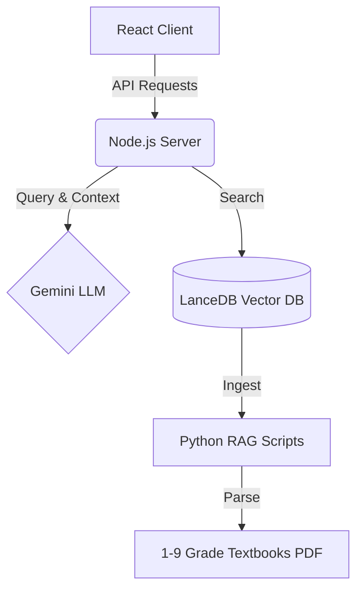

<div align="center">

# 🎓 EduAgent : AI Tutor for K-9 Education

**An Open-Source, RAG-Powered AI Tutoring System specifically designed for K-9 Students**

[](https://reactjs.org/)
[](https://nodejs.org/)
[](https://python.org/)
[](https://lancedb.com/)
[](https://opensource.org/licenses/MIT)
[](https://github.com/Zenglian990/AI_Tutor_Release/actions)

[**中文版**](README.md) | [**English**](README_en.md)

*"Education equality is not just a slogan. We aim to bring top-tier AI private tutors to every ordinary household."*

</div>

---

## 📸 UI Showcase

<div align="center">
  
  <br/>
  
  <br/>
  
</div>

---


## English Version

### 🎯 Overview
**EduAgent** is an open-source, RAG-powered AI tutoring system specifically designed for K-9 students. Utilizing Google's Gemini models and LanceDB, it provides an adaptive, localized, and interactive educational experience.

"Education equality is not just a slogan. We aim to bring top-tier AI private tutors to every ordinary household."

### 🌟 Features

EduAgent abandons the traditional "give the answer directly" model. Instead, it builds a true **guided agent** based on LLMs (Gemini) and precise vector databases (RAG):

- 🧠 **Dual-Modal Teaching Engine**:
  - **Grades 1-3 (Playful Mode)**: Lively language, encouraging tone, and metaphors to protect children's interest in learning.
  - **Grades 4-9 (Logical Mode)**: Focuses on mind maps, logical deduction, and closed-loop mistake tracking.
- 📚 **Precise RAG Knowledge Base**: Deeply integrates official K-9 textbook PDFs. All AI answers prioritize citing original textbook text, eliminating LLM "hallucinations".
- 🗣️ **Socratic Method**: It never gives the final answer immediately when encountering difficult problems. Instead, it guides the child to solve the problem independently through heuristic questioning (e.g., "What do you think we should calculate first?").
- 📷 **Multi-modal Problem Search**: Supports uploading photos of homework. The AI automatically performs OCR parsing and provides step-by-step guidance.
- 📒 **Smart Mistake Notebook**: Automatically tracks and records knowledge points where the child frequently makes mistakes, and supports one-click generation of variation exercise sheets.

### 🛠️ Tech Stack



### 🚀 Quick Start

Thanks to our highly automated startup scripts, you **DO NOT** need to manually configure complex Node.js or Python dependencies.

#### 1. Clone the repository
```bash
git clone https://github.com/Zenglian990/AI_Tutor_Release.git
cd AI_Tutor_Release
```

#### 2. One-Click Start (Fully Automated)
- **Windows**: Double-click to run `启动AI辅导.bat`
- **Mac/Linux**: Run `sh start.sh` in your terminal

> **🪄 Magic Experience**: The script will automatically check your Node.js environment, **download all backend/frontend dependencies, and build the React frontend automatically**.
> On first run, it will **automatically prompt** you to enter your `Gemini API Key` (get one for free at Google AI Studio), and then start the server directly!

The system will automatically open the main interface at `http://localhost:3001`.

#### 3. About the Knowledge Base (RAG Textbook Data)

We support two flexible setup methods:

- **⚡ Option A: Instant Demo (Zero-Config Built-in Data)**
  No Python setup required! Run directly in your terminal:
  ```bash
  npm run seed:demo
  ```
  This command seeds core curriculum chapters for Grades 1-9 (elementary math & Chinese, junior high rational numbers, Pythagorean theorem, physics acoustics, chemistry, etc.) into your local LanceDB instance with 768-dim vector alignment and FTS indexing. You can immediately test textbook-grounded RAG!

- **📚 Option B: Full K-9 Textbook Ingestion (Batch PDF Processing)**
  If you have the full set of K-9 PEP (人教版) textbook PDFs:
  1. Install Python extraction dependencies:
     ```bash
     pip install -r requirements.txt
     ```
  2. Place your textbook PDFs into `data/textbooks/` (recommended naming format: `人教版_数学_七年级上册.pdf`).
  3. Run the multimodal ingestion script:
     ```bash
     python scripts/ingest_2_0.py
     ```
  The pipeline utilizes EasyOCR / Gemini Vision to intelligently parse diagrams, formulas, and textbook structures into high-density vector chunks.

## 🤝 Contributing
We highly welcome contributions from community members! Whether you are a developer, an educator, or a parent, you are welcome to submit Pull Requests or open Issues. Let's work together to polish this tool and benefit more ordinary families.

---
*Built with ❤️ by 曾练 (Zeng Lian) & the Open Source Community*
