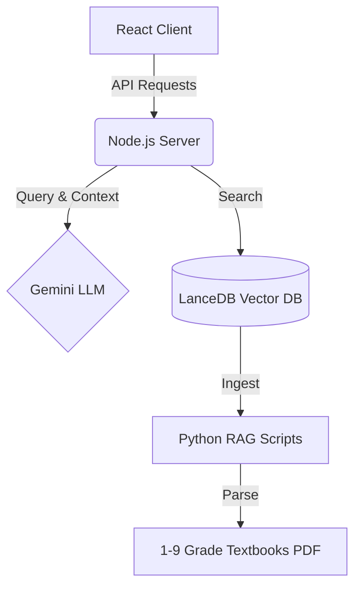

<div align="center">

# 🎓 EduAgent : AI Tutor for K-9 Education

**An Open-Source, RAG-Powered AI Tutoring System specifically designed for K-9 Students**

[](https://reactjs.org/)
[](https://nodejs.org/)
[](https://python.org/)
[](https://lancedb.com/)
[](https://opensource.org/licenses/MIT)

[**中文版**](README.md) | [**English**](README_en.md)

*"Education equality is not just a slogan. We aim to bring top-tier AI private tutors to every ordinary household."*

</div>

---


## English Version

### 🎯 Overview
**EduAgent** is an open-source, RAG-powered AI tutoring system specifically designed for K-9 students. Utilizing Google's Gemini models and LanceDB, it provides an adaptive, localized, and interactive educational experience.

"Education equality is not just a slogan. We aim to bring top-tier AI private tutors to every ordinary household."

### 🌟 Features

EduAgent abandons the traditional "give the answer directly" model. Instead, it builds a true **guided agent** based on LLMs (Gemini) and precise vector databases (RAG):

- 🧠 **Dual-Modal Teaching Engine**:
  - **Grades 1-3 (Playful Mode)**: Lively language, encouraging tone, and metaphors to protect children's interest in learning.
  - **Grades 4-9 (Logical Mode)**: Focuses on mind maps, logical deduction, and closed-loop mistake tracking.
- 📚 **Precise RAG Knowledge Base**: Deeply integrates official K-9 textbook PDFs. All AI answers prioritize citing original textbook text, eliminating LLM "hallucinations".
- 🗣️ **Socratic Method**: It never gives the final answer immediately when encountering difficult problems. Instead, it guides the child to solve the problem independently through heuristic questioning (e.g., "What do you think we should calculate first?").
- 📷 **Multi-modal Problem Search**: Supports uploading photos of homework. The AI automatically performs OCR parsing and provides step-by-step guidance.
- 📒 **Smart Mistake Notebook**: Automatically tracks and records knowledge points where the child frequently makes mistakes, and supports one-click generation of variation exercise sheets.

### 🛠️ Tech Stack



### 🚀 Quick Start

#### 1. Prerequisites
- **Node.js** (v18 or higher)
- **Python** (3.8 - 3.11)

#### 2. Install and Build
```bash
# Clone the repository and install backend dependencies
git clone https://github.com/Zenglian990/AI_Tutor_Release.git
cd AI_Tutor_Release
npm install

# Install Python dependencies (for RAG knowledge base updates)
pip install -r requirements.txt

# Build the frontend application
cd client && npm install && npm run build && cd ..
```

#### 3. Environment Variables Configuration
Copy the configuration template and fill in your keys:
```bash
cp .env.example .env
```
Fill in the following inside `.env`:
- `GEMINI_API_KEY`: Your Google Gemini API Key
- `PROXY_URL`: (Optional) Proxy address, e.g., `http://127.0.0.1:7897`

#### 4. Knowledge Base Initialization
> **🎁 Out-of-the-box**: This release includes approximately 90MB of pre-built vector data for K-9 textbooks. You can skip this step and start directly!

To load the latest textbooks:
```bash
# Place PDF textbooks into data/textbooks/ and run:
python scripts/ingest_2_0.py
```

#### 5. Start the Service
- **Windows**: Double-click to run `启动AI辅导.bat`
- **Mac/Linux**: `sh start.sh` or run `npm start` directly
After the service starts, the system will automatically open `http://localhost:3001`.

## 🤝 Contributing
We highly welcome contributions from community members! Whether you are a developer, an educator, or a parent, you are welcome to submit Pull Requests or open Issues. Let's work together to polish this tool and benefit more ordinary families.

---
*Built with ❤️ by 曾练 (Zeng Lian) & the Open Source Community*
