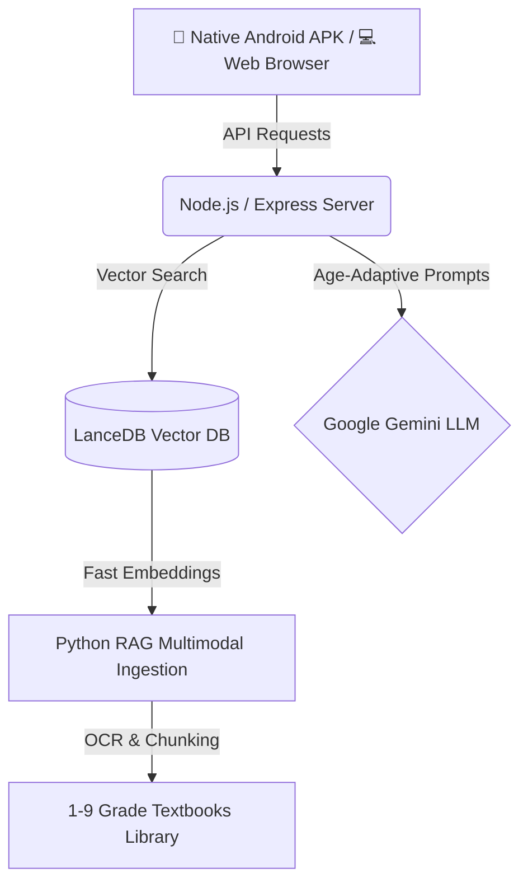

<div align="center">

# 🎓 ZengLian AI Tutor (曾练专属私教)

**The Next-Gen Open-Source RAG AI Tutoring System specifically tailored for K-9 Education**
*Comprehensive K-9 Textbooks Knowledge Base · Dual-Modal Adaptive Mind Engines · Closed-Loop Learning System*

<br/>

[](https://github.com/Zenglian990/AI_Tutor_Release/releases/download/v1.3.1/ZengLian_AI_Tutor_v1.3.1.apk)
[](https://github.com/Zenglian990/AI_Tutor_Release/releases/download/v1.0.0-apk/ZengLian_AI_Tutor_v1.0.0.ipa)
[](https://ai-tutor-release.onrender.com)
[](https://github.com/Zenglian990/AI_Tutor_Release/releases/tag/v1.3.1)

<br/>

[](https://reactjs.org/)
[](https://nodejs.org/)
[](https://capacitorjs.com/)
[](https://lancedb.com/)
[](https://deepmind.google/technologies/gemini/)
[](https://opensource.org/licenses/MIT)

[**中文文档**](README.md) | [**English**](README_en.md) | [**🤖 Android APK (v1.3.1)**](https://github.com/Zenglian990/AI_Tutor_Release/releases/download/v1.3.1/ZengLian_AI_Tutor_v1.3.1.apk) | [**🍎 iOS Guide**](#-multi-platform-support-android--ios--pc) | [**🌐 Cloud Web**](https://ai-tutor-release.onrender.com)

> *"Education equality is not just a slogan. We aim to bring top-tier AI private tutors to every ordinary household."*

</div>

---

## 📱 Multi-Platform Support (Android / iOS / PC)

Zero complicated dev setup required. Enjoy seamless, synchronized tutoring across mobile phones, tablets, and desktop computers:

### 🤖 1. Android (Phone & Tablet)
- **📥 Direct APK Download**: [ZengLian_AI_Tutor_v1.3.1.apk (~8.9MB)](https://github.com/Zenglian990/AI_Tutor_Release/releases/download/v1.3.1/ZengLian_AI_Tutor_v1.3.1.apk)
- **📥 Legacy Fallback**: [ZengLian_AI_Tutor_v1.3.0.apk](https://github.com/Zenglian990/AI_Tutor_Release/releases/download/v1.3.0/ZengLian_AI_Tutor_v1.3.0.apk)
- **✨ Features**: High-fidelity universal audio channel, sub-second speech synthesis, strict 9:16 portrait lock, zero-configuration startup.

### 🍎 2. iOS (iPhone & iPad)
- **🌟 Method A (Recommended · Zero-Certificate · Add to Home Screen in 1s)**:
  1. Open Safari on your iPhone/iPad and visit: [https://ai-tutor-release.onrender.com](https://ai-tutor-release.onrender.com)
  2. Tap the **Share button 📤** at the bottom of Safari;
  3. Scroll down and tap **"Add to Home Screen"** ➔ Tap **"Add"** at top right;
  4. The **【曾练专属私教】** native App icon appears on your home screen with immersive full-screen UX and camera support!
- **📦 Method B (IPA Native Package)**:
  - [Download ZengLian_AI_Tutor_v1.0.0.ipa](https://github.com/Zenglian990/AI_Tutor_Release/releases/download/v1.0.0-apk/ZengLian_AI_Tutor_v1.0.0.ipa)
  - Install via AltStore, Sideloadly, or Apple Enterprise Certificate.

### 💻 3. PC Desktop (Windows / Mac / Linux)
- Direct browser access: [https://ai-tutor-release.onrender.com](https://ai-tutor-release.onrender.com)
- Large eye-protection display, keyboard shortcuts, one-click A4 test paper printing preview (`Ctrl+P`), and LAN network printer integration.

---

## 📸 UI Showcase

<div align="center">
  <h3>🖥️ 1. Modern Guided Tutoring & Concept Mind Maps</h3>
  
  <p><i>Deep step-by-step guidance, hierarchical mind maps, instant traps & clues breakdown, full page checking</i></p>
  <br/>

  <h3>📐 2. Immersive Scratchpad & Geometry/Parabola Whiteboard</h3>
  
  <p><i>Handwritten scratchpad, dynamic geometry points, parabola sandbox, and instant "Grade My Scratchpad" AI audit</i></p>
  <br/>

  <h3>🗺️ 3. Interactive Gamified Learning Map</h3>
  
  <p><i>Chapter exploration islands, progressive stage unlock, turning repetitive homework into an adventure</i></p>
  <br/>

  <h3>🧭 4. Semester Roadmap & Boss Stages</h3>
  
  <p><i>Full semester dungeon overview with clear targets, core theorems, and rigorous geometric proof advice</i></p>
  <br/>

  <h3>📝 5. Smart Mistake Notebook & Targeted Variation Sheets</h3>
  
  <p><i>Ebbinghaus review schedules, one-click printable A4 layout, AI-generated variant exercises</i></p>
  <br/>

  <h3>📊 6. Parent Supervision & Weekly Learning Diagnostics</h3>
  
  <p><i>Actionable analytics, weak spot identification, customized parenting guidance, printable teacher notes</i></p>
  <br/>

  <h3>🎨 7. Social Achievement Posters for WeChat / Social Media</h3>
  
  <p><i>High-aesthetic social poster rendering with personal QR codes and motivational quotes</i></p>
</div>

---

## 🌟 Core Features

**ZengLian AI Tutor** eliminates the drawbacks of traditional "homework search engines" that encourage rote copying. Utilizing large language models and LanceDB textbook vector knowledge bases, it establishes a true **"Learn - Practice - Test - Guide - Manage" closed-loop tutoring agent**:

- 🧠 **Dual-Modal Teaching Engines for Grades 1-9**:
  - **Grades 1-3 (Playful Mode)**: Lively language, encouraging tone, and vivid metaphors to nurture curiosity and focus.
  - **Grades 4-9 (Logical Mode)**: Employs mind maps, multi-step derivation scaffolding, and rigorous counter-questioning.
- 🗣️ **Socratic Heuristic Tutoring**:
  - Guides students step-by-step rather than spoon-feeding final answers.
  - Features real-time Text-to-Speech (TTS), draft scratchpad, instant full-page correction, and trap analysis.
- 🗺️ **Gamified Knowledge Graph**:
  - Maps complete textbook curricula into explorable stages and dungeons with progressive locks.
- 📒 **Mistake Closed Loop & Targeted Variation Practice**:
  - Automatically captures flawed concepts, generates parallel variations, and exports clean A4 test papers.
- 📊 **Parent Supervision & Academic Diagnosis**:
  - Generates comprehensive weekly reports with personalized parent follow-up recommendations.
- 📱 **Cross-Platform Access**:
  - **Web Application**: Immersive desktop multi-window experience.
  - **Native Android APK**: Tailored for 9:16 portrait phones.

---

## 🛠️ Tech Stack



---

## 🚀 Quick Start for PC

With our automated startup scripts, you **DO NOT** need to manually configure complicated dependencies.

### 1. Clone the repository
```bash
git clone https://github.com/Zenglian990/AI_Tutor_Release.git
cd AI_Tutor_Release
```

### 2. One-Click Start (Fully Automated)
- **Windows**: Double-click `启动AI辅导.bat`
- **Mac/Linux**: Execute `sh start.sh` in your terminal

> The script automatically installs required dependencies, builds the frontend, and prompts for your `Gemini API Key` before opening `http://localhost:3001` in your browser.

---

## 🤝 Contributing

Contributions are warmly welcomed! Whether you are a developer, an educator, or a parent, feel free to open a Pull Request or file an Issue.

---

*Built with ❤️ by Zeng Lian & the Open Source Community*
