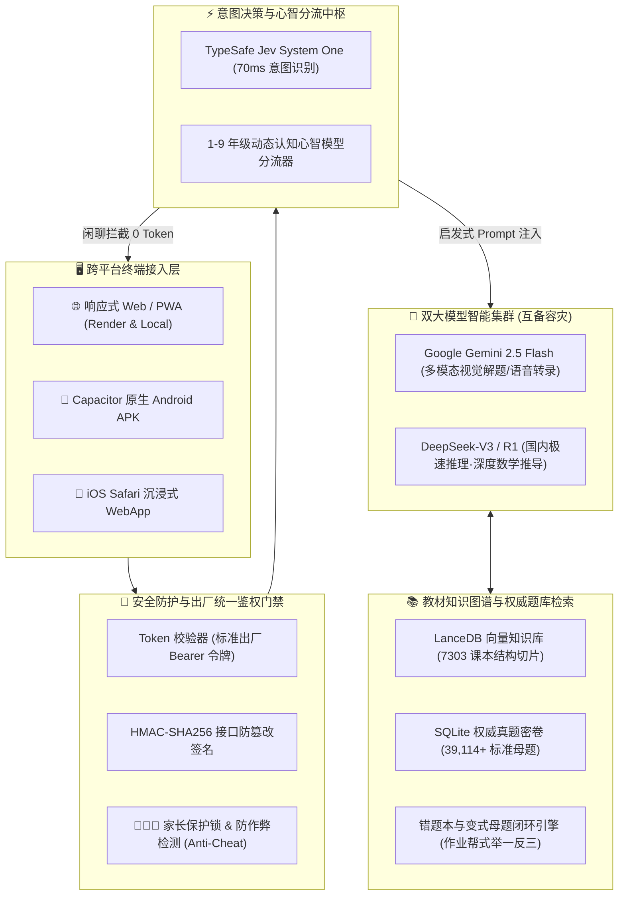

# 🏛️ 曾练专属私教 (ZengLian AI Tutor) 系统架构与 1-9 年级心智模型白皮书

本文档系统阐述 **曾练专属私教 (ZengLian AI Tutor)** 的技术拓扑、分层架构、1-9 年级全学段认知心智引擎、以及双大模型灾备路由体系。

---

## 📐 1. 核心系统架构拓扑 (System Topology)

---

## 🧠 2. 1-9 年级全学段动态心智模型 (Cognitive Mind Models)

教育不是单一的知识搬运，必须严格契合中小学生皮亚杰认知发展阶段：

### 🎒 低年级（小学 1 - 3 年级）：前运算向具体运算过渡
- **认知特征**：以具体形象思维为主，抽象数字符号理解门槛高，注意力易分散。
- **教学策略**：
  - **实物具象积木化**：将“乘法”具象为分糖果、摆苹果网格；
  - **天平物理模型**：讲等式时引入虚拟天平，直观感受“加减平衡”；
  - **正向激励伴学**：由“聪聪小狮子”导师进行阶梯式趣味引导，避免机械死记。

### 📘 中年级（小学 4 - 6 年级）：具体运算成熟期
- **认知特征**：开始建立守恒观念与因果逻辑，能进行多步骤运算法则拆解。
- **教学策略**：
  - **场景化分步拆解**：列方程解应用题时，引导孩子圈出已知条件和未知关系；
  - **错因归因胶囊**：引导识别是“粗心看错”、“公式生疏”还是“题意未懂”；
  - **草稿纸习惯养成**：提供电子草稿纸，引导工整草稿与检验反思。

### 📐 高年级（初中 7 - 9 年级）：形式运算与抽象逻辑期
- **认知特征**：具备假设-演绎思维，几何逻辑证明、代数压轴题对严密性要求极高。
- **教学策略**：
  - **几何辅助线灵感锁**：压轴几何证明题不直接给答案，而是阶梯式提供“仅看辅助线作法”（如倍长中线、作垂线构造直角三角形），保留学生的思考心流；
  - **结构化思维导图**：知识复习串联为 Mermaid 逻辑图谱；
  - **作业帮式举一反三**：每道错题自动派发【同类母题巩固】+【避坑拔高变式】练习，闭环通关。

---

## ⚡ 3. 双大模型与 Jev 毫秒级决策引擎

1. **TypeSafe Jev System One**：
   - 70ms 毫秒级意图拦截无意义闲聊、纯打招呼等提问，**0 Token 成本**秒回，节省高达 35%~40% 的上游推理 Token 消耗。
   - 实时识别学生情绪挫败感（如连续错题、暴躁情绪），自动切换鼓励语气。
2. **DeepSeek 与 Google Gemini 闪电双通道**：
   - **国内免翻墙高速通道**：DeepSeek 直连延迟低至 340ms，保障网络环境受限家庭顺畅使用；
   - **多模态视觉之王**：Gemini 2.5 Flash 针对复杂几何图、试卷大图手写批注提供极高召回率；
   - **冷备自动倒换**：管理控制台一键测速诊断，实时热保存生效。

---

## 🔐 4. 工业级安全与出厂统一认证

- **标准官方令牌机制 (`ait_ca1b...`)**：容器重启（Render/Docker）令牌永不脱节，开箱即用免二次配置；
- **前端实时加密持久化**：管理控制台所有配置采用本地 AES 安全存储，并提供一键【重置标准】保护机制；
- **防作弊模式 (Anti-Cheat Mode)**：家长可一键开启自律答题锁，隐藏一键解答入口，强制走阶梯启发模式。

---

*Version: v1.5.5 | ZengLian AI Tutor Core Architecture*
